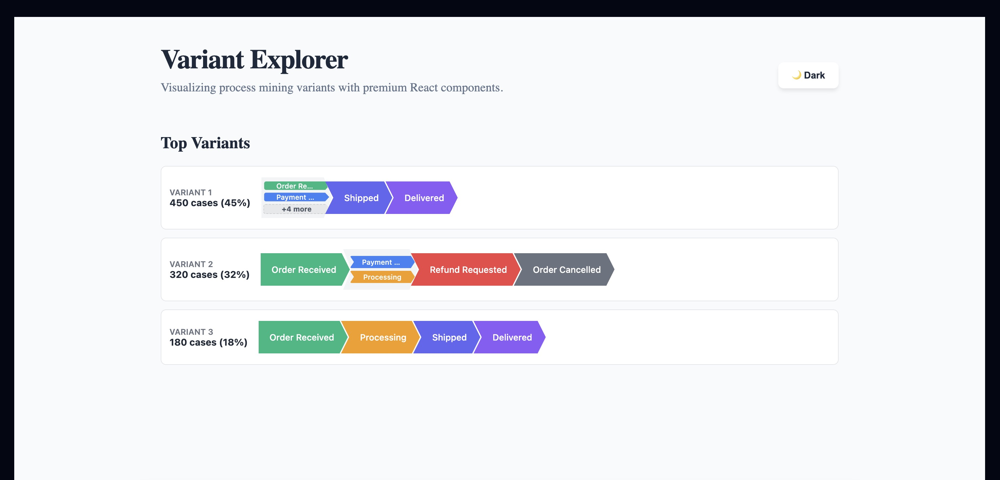
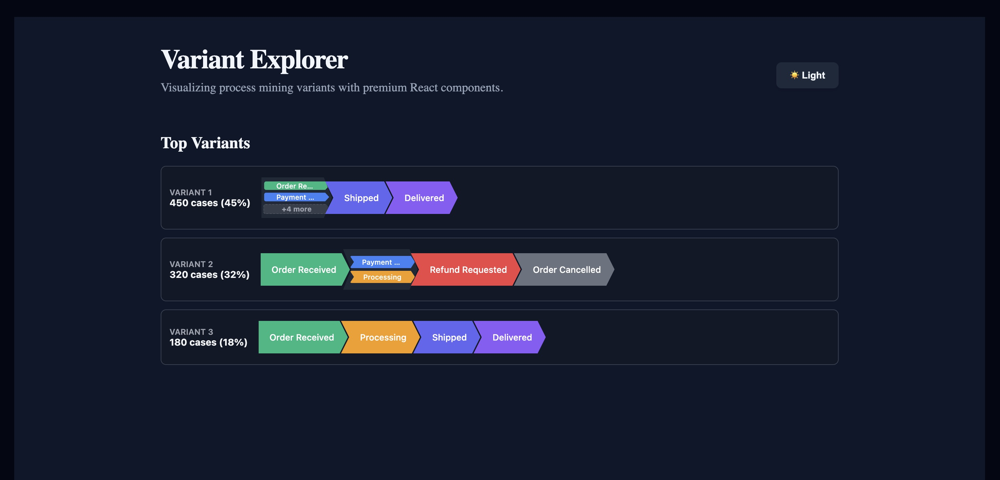
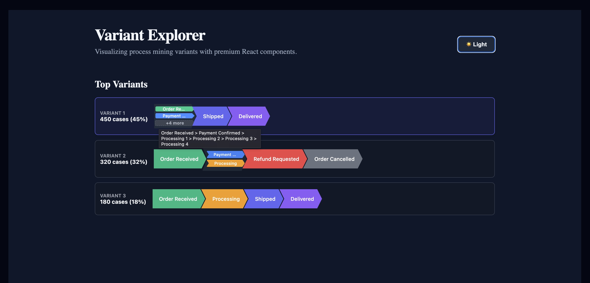

# React Variant Explorer

A premium, high-performance React component for visualizing process mining variants with a modern, flat aesthetic.

## Preview

### Light Mode


### Dark Mode


### Dark Mode with Detail



## Features

- 🚀 **Grouped Activities**: Handle multiple activities in a single step with vertical stacking and smart truncation (+N more).
- 🌓 **Theming**: Full support for Light, Dark, and System modes.
- 🎨 **MUI Inspired**: Clean, flat design inspired by Material UI charts.
- 🧩 **TypeScript**: Fully typed for a great developer experience.
- 📦 **Zero Config Styling**: Styles are automatically injected into the bundle.

## Installation

```bash
npm install react-variant-explorer
```

## Quick Start

```tsx
import { VariantExplorer } from 'react-variant-explorer';

const variants = [
  {
    id: 'v1',
    rank: 1,
    frequency: 450,
    percentage: 45,
    steps: [
      { id: 'a1', label: 'Order Received', color: '#10b981' },
      [
        { id: 'a2', label: 'Payment Confirmed', color: '#3b82f6' },
        { id: 'a3', label: 'Processing', color: '#f59e0b' },
      ],
      { id: 'a4', label: 'Shipped', color: '#6366f1' },
    ]
  }
];

function App() {
  return (
    <VariantExplorer 
      variants={variants} 
      theme="system"
      onActivityClick={(data, variant) => console.log(data)}
    />
  );
}
```

## Props

| Prop | Type | Default | Description |
| :--- | :--- | :--- | :--- |
| `variants` | `Variant[]` | `[]` | Array of variant data to display. |
| `theme` | `'light' \| 'dark' \| 'system'` | `'system'` | The UI theme mode. |
| `onActivityClick` | `(data, variant) => void` | `undefined` | Callback when a step is clicked. |
| `className` | `string` | `''` | Custom CSS class for the container. |
| `style` | `React.CSSProperties` | `{}` | Custom styles for the container. |

---

## 📬 Contact

Feel free to reach out:

- 📸 Instagram: [@drsinaasghari](https://instagram.com/drsinaasghari)
- ✈️ Telegram: [@drsinaasghari](https://t.me/drsinaasghari)

## License

MIT © Sina Asghari
